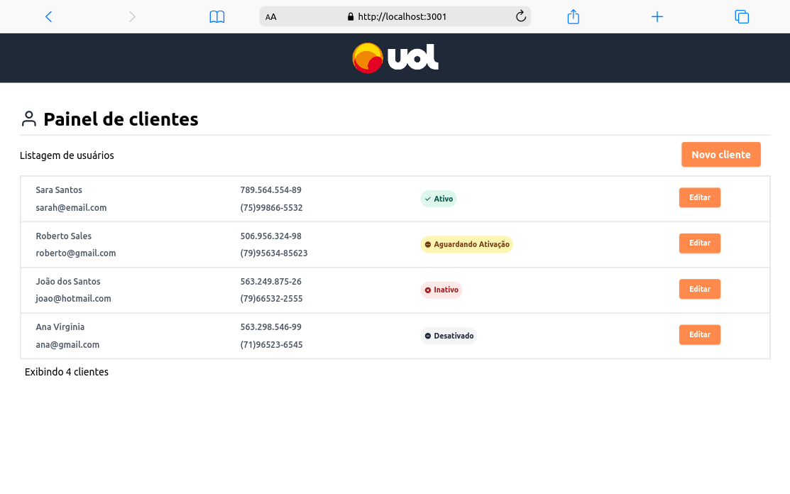
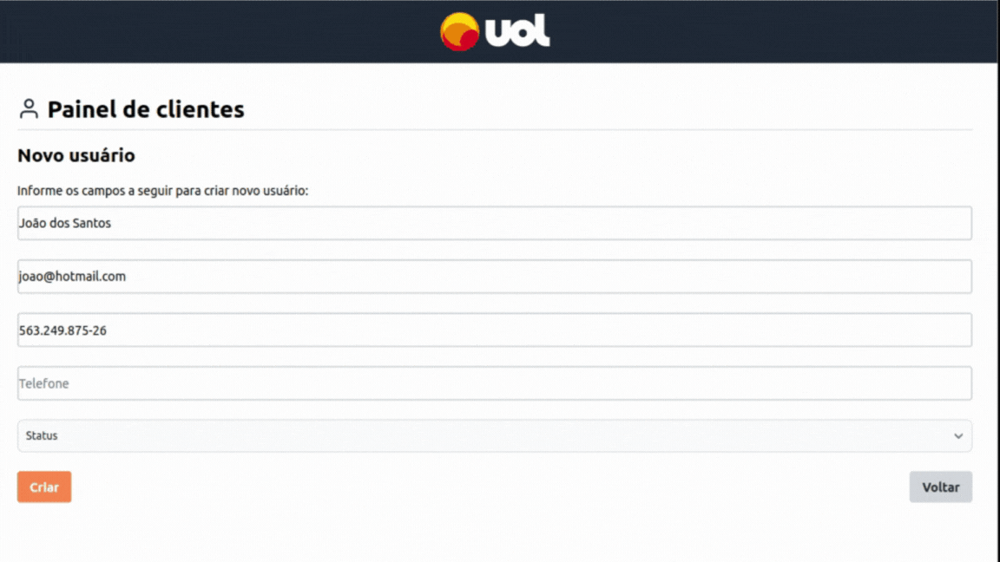

<h1>Teste Fullstack: Aplicativo de Gerenciamento de Clientes</h1>

<h2> Tecnologias Utilizadas </h2>

+ *Docker*, para a conteinerização da aplicação;
+ *ESLint*, para padronização e correção do código;
+ *Git*, para versionamento;
+ *VS Code*, para edição do código;
+ *Node.js*, para execução de testes e instalação de pacotes de bibliotecas;
+ *SQLite*, para criação de uma API simples com somente uma tabela no banco de dados;
+ *Jest*, para realizar tests no backend;
+ *TypeScript*, para tipagem da linguagem tanto front quanto do back;
+ *Vite React*, framework para o desenvolvimento do frontend;
+ *Flowbite Tailwind*, library para estilização;

<h2>Como usar</h2>

 1 - Na pasta App inicie o Docker Compose:
docker-compose up --build 

 2 - Abra http://localhost:3001/
 

<h3>Para utilizar o repositório no desenvolvimento, siga os passos abaixo:</h3>

- Para instalar as dependências e colocar em desenvolvimento o Frontend:
Na pasta do Frontend:
`npm install`  `npm run start`

- Para instalar as dependências e colocar em desenvolvimento o Backend:
Na pasta do backend:
`npm install`  `npm run dev`

- Para fazer os testes do Backend:
Na pasta do backend:
`npm run test`